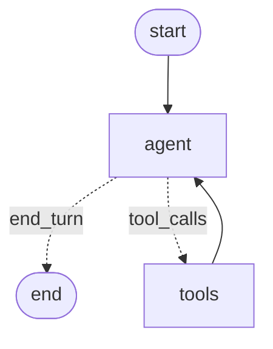
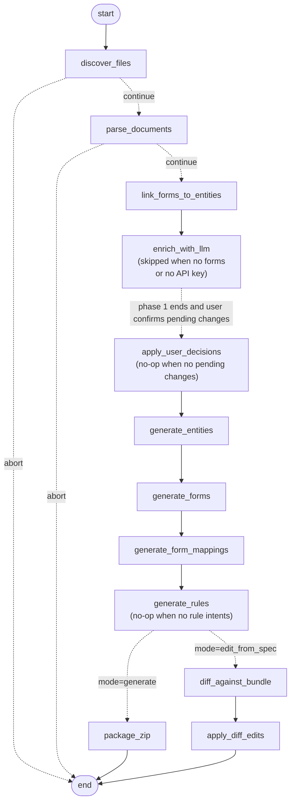

# Avni Bundle Generator

Now, you can turn Avni modelling and scoping Excel documents into a ready-to-upload Avni bundle ZIP in a couple of minutes. 

Sheets are parsed and issues like below are flagged to user:
- field names longer than 255 chars, 
- duplicate field names within a form 
- and duplicate coded concepts across forms with different options. 
Each proposed rename is shown to the user for confirmation before being applied.

Below rule generation are currently supported:
1. Form element rule
2. Decision rule
3. Visit schedule rule
4. Edit form rule
5. Validation rule

Via chat interface as well, above rule types can be generated.

Demo: [screen recording of how it works](https://drive.google.com/file/d/1eS7CKgKALokv4qZUwgn_V5xawQ4SRtHU/view?usp=sharing).

---
# Setup of scoping sheet for uploading in a deployed environment

Reference: [sample scoping sheet](https://docs.google.com/spreadsheets/d/1xhdPMguUjNwKE8IndRbJwqjv9FjOvYkDx7bRyCNT2lM/edit?usp=sharing).

### Form level rules

The scoping workbook needs to include a `Rules` (or `Form Rules`) tab. Tab format — one row per form, one column per rule kind. Cells are natural-language intent — no syntax required.
Any subset of the below supported columns may appear:

| Form name | Visit Schedule Rule | Validation Rule | Edit Form Rule | Decision Rule |
|---|---|---|---|---|
| `ANC Followup` | "schedule next visit 30 days later" | "weight must be between 30 and 120 kg" | | |
| `Adult Registration` | | "age must be between 18 and 60" | "only the user who created the record can edit" | "set Age Group to Adult when age ≥ 18" |
| `Pregnancy Exit` | "return empty" | | | |

### Field-level rules — columns on each form sheet

Field-level rules (`formElementRule`) don't use the `Rules` tab — they come from optional per-field columns on the form sheets themselves. Five behaviour columns are recognised (any alias works):

| Column aliases | What the generated rule does |
|---|---|
| `when to show`, `visibility`, `skip logic`, `condition` | show the field only when … |
| `when not to show`, `hide when` | hide the field when … |
| `default_value`, `default value`, `pre-fill` | pre-fill or compute the value |
| `validation`, `validate when`, `block save when` | raise a validation error when … |
| `option condition`, `show options when`, `filter options` | restrict the coded answer options |

Cells are natural language, same as the `Rules` tab. Common visibility patterns (e.g. an "Other — specify" field paired with a coded field's `Others` option) are auto-detected even without any column.

---

# Local Setup

Requires Python 3.11+.

```bash
git clone git@github.com:avniproject/avni-autopilot.git
cd avni-autopilot
pip install -e .
cp .env.example .env       # then edit .env and set ANTHROPIC_API_KEY
```

`.env.example` documents every supported variable (chat model, bundle I/O paths, LangSmith tracing, log level). Only `ANTHROPIC_API_KEY` is required for bundle generation and field editing.

For **rule generation**, also set:

```
VOYAGE_API_KEY=pa-...    # required when generating rules — embeds the KB catalog + queries
```

Voyage's free tier (3 RPM / 10K TPM) works for first runs but is slow; adding a payment method to the Voyage dashboard unlocks standard limits (200M free tokens included). The embedder retries automatically on rate limits — see `domain/rules/knowledge_base.py` for the env-var overrides if you want to tighten or loosen the throttle.

#### Maintaining the knowledge bases

Rebuilding embeddings — each knowledge base has one rebuild command; re-embedding is content-hash-gated, so both are cheap to run after any catalog edit:

```bash
avni-rules-kb rebuild    # rules KB — after editing resources/rules/ helpers or examples directly
avni-docs-kb rebuild     # docs KB  — after editing resources/docs/entries/*.json
```

Both write a `.embeddings.json` next to their catalog; commit the refreshed cache so fresh checkouts and deployments start warm. If not done, service startup will refresh the cache/embeddings. 

#### Optional: LangSmith tracing

To capture per-call cost and latency for every LLM/graph step (enrichment passes, ReAct turns, tool calls) on the [LangSmith](https://smith.langchain.com) dashboard, add the following to `.env`:

```
LANGSMITH_TRACING=true
LANGSMITH_API_KEY=lsv2_pt_...
LANGSMITH_PROJECT=avni-ai-tools          # any name; groups traces in the UI
# LANGSMITH_ENDPOINT=https://api.smith.langchain.com   # default; override for EU/self-hosted
```

### Usage via command prompt

`src/chat/` is a conversational front door over the ReAct agent (`claude-sonnet-4-6` via `ChatAnthropic`) that exposes tools.

Drop your modelling and scoping Excel files into `resources/input/<org>/`, then:

```bash
avni-chat
```

If the LLM enrichment pass finds anything that needs your input, the run pauses and the agent presents each proposed change for confirmation. Also, fields can be added, removed, edited and supported rules can be updated. 
Sample session:

```
you> generate srijan
  ⚙ generate_bundle({"org": "srijan"})
agent> ### Change 1 of 2 — Long Name Shortening
       Form:  Baseline for Men
       Before: "In many families, women wake up early to cook…"
       After:  "Why do women do most household chores?"
       Reason: Field name exceeds 255 characters.

       Reply: yes / no / edit:<your value>

you> 1. yes 2. yes
agent> Bundle generated successfully. Subject types: 1, programs: 2, encounter types: 9, …
you> for what org did you generate bundle for?
agent> srijan
you> rename 'Mode of Visit' in that section to 'Visit Mode'
  ⚙ edit_bundle_fields({"bundle_path": "...", "operations": [{"op_id":"op-1","kind":"field.rename", …}]})
agent> Renamed. Forms modified: ANC_<uuid>.json. 1 form element renamed, 1 concept appended.
you> schedule the endline 2 days later if the answer to 'why do you want to work' is supporting
     family; 4 days if financial independence; 6 days if more confident.
     Don't schedule on Sundays.
  ⚙ list_bundle_fields({"bundle_path": "..."})
agent> I'll match 'supporting family' → 'can support my family',
       'financial independence' → 'It gives me financial independence',
       'more confident' → 'It makes me feel more confident and independent'.
       Confirm?
you> yes
  ⚙ set_form_rule({"bundle_path": "...", "form_name": "Baseline for Women", "rule_kind": "visitScheduleRule", "intent": "..."})
agent> Rule written. Confidence: high. Used helpers: VisitScheduleBuilder.add, RuleCondition.valueInRegistration, …

```

You can also reply `edit:Some shorter text` for any change to override the LLM's proposed rename.

Slash commands (no token cost): `/quit`, `/clear` (new thread), `/history`, `/help`.

### Running as a service (`avni-ai-web`)

A FastAPI service exposes the same chat agent over HTTP + Server-Sent Events, so a browser can drive bundle generation against a hosted instance. 

#### Required configuration

In addition to `ANTHROPIC_API_KEY` (and optionally `VOYAGE_API_KEY` for rule generation), set:

```
AVNI_SERVER_BASE_URL=https://staging.avniproject.org   # token check + bundle upload
AI_WEBAPP_ORIGIN=http://localhost:6010                  # CORS allowlist for the React UI
```

When iterating on autopilot changes alongside `avni-webapp` locally, you'll usually want the browser to hit your local autopilot rather than whatever URL `avni-server`'s `/idp-details` reports (which is typically the staging or prod autopilot).

1. **Run autopilot locally on port 8023:**

   ```bash
   cd ~/projects/AI
   uv run avni-autopilot      # binds 0.0.0.0:8023; reads .env
   curl -fsS http://localhost:8023/health      # expected: {"ok":true}
   ```

   Your local `.env` needs at minimum `ANTHROPIC_API_KEY`, `VOYAGE_API_KEY` (if rule generation is exercised), and `AVNI_SERVER_BASE_URL` pointing at whichever avni-server holds the auth token the webapp is logged in against (e.g. `https://staging.avniproject.org` if the webapp is logged in to staging).

2. **Tell the webapp to use the local autopilot instead of the avni-server-reported URL.** In the webapp tab's DevTools console (URL must be `http://localhost:6010/...`):

   ```js
   localStorage.setItem("AI_ASSISTANT_URL_OVERRIDE", "http://localhost:8023")
   location.reload()
   ```

   Verify:

   ```js
   localStorage.getItem("AI_ASSISTANT_URL_OVERRIDE")
   // expected: "http://localhost:8023"
   ```

   The webapp's `useAiApi()` hook checks this localStorage key first and falls back to Redux (`state.app.genericConfig.avniAi.mcpServerUrl`) when absent — so the override is per-browser and zero-cost in production.

3. **Turn the override off** when done:

   ```js
   localStorage.removeItem("AI_ASSISTANT_URL_OVERRIDE")
   location.reload()
   ```

`localStorage` is **per-origin**, so the value set on `http://localhost:6010` is invisible on `https://staging.avniproject.org` and vice-versa — make sure DevTools is open on the webapp tab you actually want to redirect.

**Optional knobs (defaults shown):**

```
AI_SESSION_DIR=/tmp/avni-ai      # per-session input + output ZIPs live here
AI_SESSION_IDLE_MIN=30            # idle reap threshold (minutes)
AI_SESSION_MAX_HOURS=2            # absolute reap threshold (hours)
AI_WEB_PORT=8080                  # the FastAPI process listens here
```

#### Run

```bash
avni-ai-web
# → uvicorn serving web.app:app on 0.0.0.0:8080
```

Hit `GET /health` to verify liveness. Browse `GET /docs` for an OpenAPI view of every endpoint.

---
# Architecture:
LangGraph is used for orchestration.

### Chat ReAct agent (`src/chat/`)

The outer LangGraph that hosts the conversation, routes tool calls, and streams responses.



### Bundle pipeline (`src/pipeline/`)

Two compiled inner LangGraphs, split around the human-in-the-loop gate, handle both **generate** (`.xlsx` → fresh bundle ZIP) and **edit-from-spec** (`.xlsx` → diff & patch an existing bundle, preserving UUIDs). Phase 1 (`discover_files` → `enrich_with_llm`) parses and enriches; the dotted edge in the middle is the phase boundary — when the enrichment pass produces pending changes, the chat tool stashes the state and asks the user, then resumes with Phase 2 (`apply_user_decisions` onward) to apply decisions and build the bundle.



---

**Notes**
- **UUIDs are deterministic** (UUID v5 over a fixed namespace + a name-derived seed). Re-running the generator with the same input produces identical UUIDs, so re-uploads are idempotent. 
