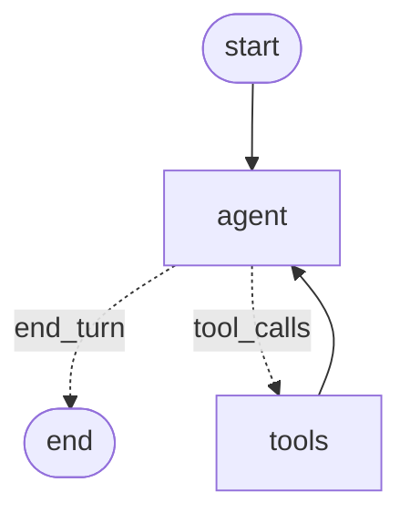
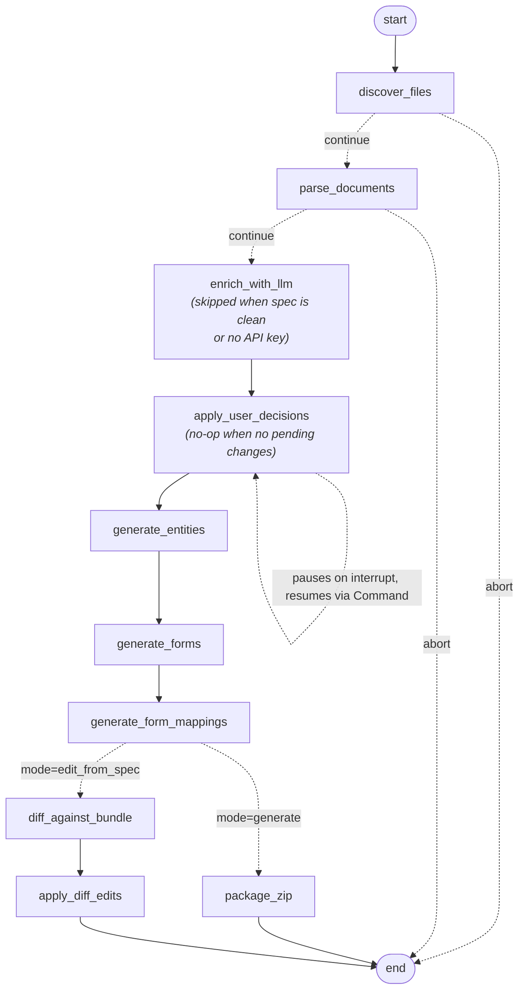

# Avni Bundle Generator

LangGraph pipeline that turns Avni modelling + scoping Excel documents into a ready-to-upload Avni bundle ZIP. A deterministic parser does the heavy lifting; Claude Haiku 4.5 then takes a second pass at each form to flag two things the parser can't safely fix on its own — field names longer than 255 chars and duplicate field names within a form. Each proposed rename is shown to the user for confirmation before being applied.

Once a bundle is generated, fields inside it can be **added, renamed, or removed** through the same chat agent without re-running the generator (see [Editing fields](#editing-fields-in-an-existing-bundle)).

---

## Setup

Requires Python 3.11+.

```bash
git clone git@github.com:avniproject/avni-autopilot.git
cd avni-autopilot
pip install -e .
cp .env.example .env       # then edit .env and set ANTHROPIC_API_KEY
```

`.env.example` documents every supported variable (chat model, bundle I/O paths, LangSmith tracing, log level). Only `ANTHROPIC_API_KEY` is required.

### Optional: LangSmith tracing

To capture per-call cost and latency for every LLM/graph step (enrichment passes, ReAct turns, tool calls) on the [LangSmith](https://smith.langchain.com) dashboard, add the following to `.env`:

```
LANGSMITH_TRACING=true
LANGSMITH_API_KEY=lsv2_pt_...
LANGSMITH_PROJECT=avni-ai-tools          # any name; groups traces in the UI
# LANGSMITH_ENDPOINT=https://api.smith.langchain.com   # default; override for EU/self-hosted
```

When tracing is on, the REPL prints a `LangSmith: tracing → project '…'` line on startup. Leave `LANGSMITH_TRACING` unset (or empty) to disable — no traces are sent and there is no runtime overhead.

---

## Usage

`src/chat.py` is a conversational front door over the pipeline — a LangGraph ReAct agent (`claude-sonnet-4-6` via `ChatAnthropic`) that exposes four tools:

Drop your modelling and scoping Excel files into `resources/input/<org>/`, then:

```bash
export ANTHROPIC_API_KEY=sk-ant-...   # or set in .env
avni-chat
```

Sample session:

```
you> generate srijan
  ⚙ generate_bundle({"org": "srijan"})
agent> Bundle generated successfully. Subject types: 1, programs: 2, encounter types: 9, …
you> for what org did you generate bundle for?
agent> srijan
```

If the LLM enrichment pass finds anything that needs your input, the run pauses and the agent presents each proposed change for confirmation:

```
agent> ### Change 1 of 2 — Long Name Shortening
       Form:  Baseline for Men
       Before: "In many families, women wake up early to cook…"
       After:  "Why do women do most household chores?"
       Reason: Field name exceeds 255 characters.

       Reply: yes / no / edit:<your value>

you> 1. yes 2. yes
agent> ✅ Bundle generated successfully!
```

You can also reply `edit:Some shorter text` for any change to override the LLM's proposed rename.

Slash commands (no token cost): `/quit`, `/clear` (new thread), `/history`, `/help`.

Conversation state is held in-memory by a `MemorySaver` checkpointer keyed by `thread_id`. It does **not** persist across REPL invocations.

---

### Editing fields in an existing bundle

A bundle ZIP can be edited directly through the chat agent.

Sample session:

```
you> list the fields in resources/output/ekam/Ekam.zip for the ANC form
  ⚙ list_bundle_fields({"bundle_path": "resources/output/ekam/Ekam.zip"})
agent> ANC has 6 sections, including "Pregnancy Follow-Up Details" with 14 fields …

you> rename 'Mode of Visit' in that section to 'Visit Mode'
  ⚙ edit_bundle_fields({"bundle_path": "...", "operations": [{"op_id":"op-1","kind":"field.rename", …}]})
agent> Renamed. Forms modified: ANC_<uuid>.json. 1 form element renamed, 1 concept appended.
```

Matching is **exact** (case-folded and whitespace-stripped, no fuzzy match). The agent should call `list_bundle_fields` before constructing operations so the names line up.

---

## Pipeline graphs

### Chat ReAct agent (`src/chat.py`)

The outer LangGraph that hosts the conversation, routes tool calls, and streams responses.



### Bundle pipeline (`src/pipeline/`)

A single inner LangGraph that handles both **generate** (`.xlsx` → fresh bundle ZIP) and **edit-from-spec** (`.xlsx` → diff & patch an existing bundle, preserving UUIDs). The two modes share the entire parse + enrich + entity-generation trunk and only diverge after `generate_form_mappings`, where `state.mode` decides the terminal branch.

Two nodes are visited unconditionally but short-circuit internally:

- **`enrich_with_llm`** only calls Claude on forms that have a real issue to fix (a field name longer than 255 chars, or duplicate field names within the same form). Clean forms pass through with zero LLM cost. The whole node is also skipped if `ANTHROPIC_API_KEY` isn't set.
- **`apply_user_decisions`** only fires LangGraph's `interrupt()` if `enrich_with_llm` produced pending changes. When the list is empty (clean spec or LLM had nothing to propose) it returns immediately — no human pause. When it does interrupt, the caller resumes via `Command(resume=resolutions)`.



### Editing fields via chat (`src/bundle_editor.py`)

Operates on a bundle ZIP (or unpacked directory) and writes back atomically.

---
## Notes

- **Rule fields** (`validationRule`, `visitScheduleRule`, `enrolmentEligibilityCheckRule`, etc.) are emitted as empty strings — translating skip logic into Avni's declarative rule format is out of scope for this version.
- **Sheet classification is content-driven**, not name-driven; the parser inspects column headers and the first column's contents rather than relying on sheet names matching a fixed list.
- **UUIDs are deterministic** (UUID v5 over a fixed namespace + a name-derived seed). Re-running the generator with the same input produces identical UUIDs, so re-uploads are idempotent. The bundle editor uses the same scheme — see [`specs/BUNDLE_EDITING_SDD.md`](specs/BUNDLE_EDITING_SDD.md) §6.
