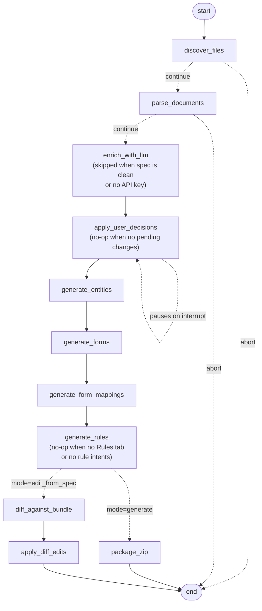

# Avni Bundle Generator

LangGraph pipeline that turns Avni modelling + scoping Excel documents into a ready-to-upload Avni bundle ZIP. A deterministic parser does the heavy lifting; Claude Haiku 4.5 then takes a second pass at each form to flag two things the parser can't safely fix on its own — field names longer than 255 chars and duplicate field names within a form. Each proposed rename is shown to the user for confirmation before being applied.

Once a bundle is generated:

- Fields inside it can be **added, renamed, or removed** through the same chat agent without re-running the generator (see [Editing fields](#editing-fields-in-an-existing-bundle)).
- **Visit-schedule rules** can be generated from natural-language intents. The pipeline picks them up automatically when the scoping workbook has a `Rules` tab (see [Rule generation as part of the pipeline](#rule-generation-as-part-of-the-pipeline)), and the chat agent can also set or update one on an already-built bundle (see [Setting a visit-schedule rule on an already-built bundle](#setting-a-visit-schedule-rule-on-an-already-built-bundle)). Rules are grounded in the bundle's actual concepts, encounter types, and coded answers; the validator rejects any reference that doesn't exist.

---

## Setup

Requires Python 3.11+.

```bash
git clone git@github.com:avniproject/avni-autopilot.git
cd avni-autopilot
pip install -e .
cp .env.example .env       # then edit .env and set ANTHROPIC_API_KEY
```

`.env.example` documents every supported variable (chat model, bundle I/O paths, LangSmith tracing, log level). Only `ANTHROPIC_API_KEY` is required for bundle generation and field editing.

For **rule generation**, also set:

```
VOYAGE_API_KEY=pa-...    # required when generating rules — embeds the KB catalog + queries
```

Voyage's free tier (3 RPM / 10K TPM) works for first runs but is slow; adding a payment method to the Voyage dashboard unlocks standard limits (200M free tokens included). The embedder retries automatically on rate limits — see `domain/rules/knowledge_base.py` for the env-var overrides if you want to tighten or loosen the throttle.

### Optional: LangSmith tracing

To capture per-call cost and latency for every LLM/graph step (enrichment passes, ReAct turns, tool calls) on the [LangSmith](https://smith.langchain.com) dashboard, add the following to `.env`:

```
LANGSMITH_TRACING=true
LANGSMITH_API_KEY=lsv2_pt_...
LANGSMITH_PROJECT=avni-ai-tools          # any name; groups traces in the UI
# LANGSMITH_ENDPOINT=https://api.smith.langchain.com   # default; override for EU/self-hosted
```

When tracing is on, the REPL prints a `LangSmith: tracing → project '…'` line on startup. Leave `LANGSMITH_TRACING` unset (or empty) to disable — no traces are sent and there is no runtime overhead.

---

## Usage

`src/chat.py` is a conversational front door over the pipeline — a LangGraph ReAct agent (`claude-sonnet-4-6` via `ChatAnthropic`) that exposes tools for: generating a bundle from xlsx (`generate_bundle`), inspecting a built bundle (`list_bundle_fields`), editing fields in place (`edit_bundle_fields`), editing a bundle from updated xlsx (`edit_bundle_from_spec`), setting visit-schedule rules from natural language (`set_visit_schedule_rule`), and resuming a paused run (`resume_bundle`).

Drop your modelling and scoping Excel files into `resources/input/<org>/`, then:

```bash
export ANTHROPIC_API_KEY=sk-ant-...   # or set in .env
avni-chat
```

Sample session:

```
you> generate srijan
  ⚙ generate_bundle({"org": "srijan"})
agent> Bundle generated successfully. Subject types: 1, programs: 2, encounter types: 9, …
you> for what org did you generate bundle for?
agent> srijan
```

If the LLM enrichment pass finds anything that needs your input, the run pauses and the agent presents each proposed change for confirmation:

```
agent> ### Change 1 of 2 — Long Name Shortening
       Form:  Baseline for Men
       Before: "In many families, women wake up early to cook…"
       After:  "Why do women do most household chores?"
       Reason: Field name exceeds 255 characters.

       Reply: yes / no / edit:<your value>

you> 1. yes 2. yes
agent> ✅ Bundle generated successfully!
```

You can also reply `edit:Some shorter text` for any change to override the LLM's proposed rename.

Slash commands (no token cost): `/quit`, `/clear` (new thread), `/history`, `/help`.

Conversation state is held in-memory by a `MemorySaver` checkpointer keyed by `thread_id`. It does **not** persist across REPL invocations.

---

## Running as a service (`avni-ai-web`)

A FastAPI service exposes the same chat agent over HTTP + Server-Sent Events, so a browser can drive bundle generation against a hosted instance. This is the backend half of [`specs/AVNI_WEBAPP_INTEGRATION_SDD.md`](specs/AVNI_WEBAPP_INTEGRATION_SDD.md); the React side lives in `avni-webapp`.

### Required configuration

In addition to `ANTHROPIC_API_KEY` (and optionally `VOYAGE_API_KEY` for rule generation), set:

```
AVNI_SERVER_BASE_URL=https://staging.avniproject.org   # token check + bundle upload
AI_WEBAPP_ORIGIN=http://localhost:6010                  # CORS allowlist for the React UI
```

Optional knobs (defaults shown):

```
AI_SESSION_DIR=/tmp/avni-ai      # per-session input + output ZIPs live here
AI_SESSION_IDLE_MIN=30            # idle reap threshold (minutes)
AI_SESSION_MAX_HOURS=2            # absolute reap threshold (hours)
AI_WEB_PORT=8080                  # the FastAPI process listens here
```

### Run

```bash
avni-ai-web
# → uvicorn serving web.app:app on 0.0.0.0:8080
```

Hit `GET /health` to verify liveness. Browse `GET /docs` for an OpenAPI view of every endpoint.

### What it does

For each browser-allocated session, the service:

1. Verifies the user's avni-server auth token (`GET /web/userInfo`) and binds the session to the org returned. The browser never picks an org.
2. Accepts xlsx uploads into the session's working directory.
3. Wraps the existing chat ReAct agent — the same one `avni-chat` uses — and streams its `agent.message`, `tool.call`, `tool.result`, `hitl.pending`, and `bundle.ready` events to the browser over SSE.
4. On `POST /sessions/{id}/upload-to-avni`, relays the generated ZIP to avni-server's existing Metadata-Zip import endpoint, reusing the admin's auth token captured at session start.

Sessions are in-memory and single-process by design — see SDD §8 for the trade-off, `specs/DEPLOYMENT_SDD.md` for the AWS shape, and SDD §11 for the v2 migration path to a persistent checkpointer.

### Endpoints

```
POST   /sessions                          create + verify token
DELETE /sessions/{session_id}             tear down
POST   /sessions/{session_id}/upload      multipart xlsx
POST   /sessions/{session_id}/message     one user turn
POST   /sessions/{session_id}/resolve     respond to a HITL interrupt
GET    /sessions/{session_id}/events      SSE stream (Last-Event-ID resume)
GET    /sessions/{session_id}/bundle      download ZIP
POST   /sessions/{session_id}/upload-to-avni    auto-upload to avni-server
GET    /health                            operational liveness
```

The `avni-chat` REPL and the `avni-rules-kb` CLI are unaffected by the service — they continue to read their own env vars and ignore the `AI_*` settings.

---

### Editing fields in an existing bundle

A bundle ZIP can be edited directly through the chat agent.

Sample session:

```
you> list the fields in resources/output/ekam/Ekam.zip for the ANC form
  ⚙ list_bundle_fields({"bundle_path": "resources/output/ekam/Ekam.zip"})
agent> ANC has 6 sections, including "Pregnancy Follow-Up Details" with 14 fields …

you> rename 'Mode of Visit' in that section to 'Visit Mode'
  ⚙ edit_bundle_fields({"bundle_path": "...", "operations": [{"op_id":"op-1","kind":"field.rename", …}]})
agent> Renamed. Forms modified: ANC_<uuid>.json. 1 form element renamed, 1 concept appended.
```

Matching is **exact** (case-folded and whitespace-stripped, no fuzzy match). The agent should call `list_bundle_fields` before constructing operations so the names line up.

---

### Setting a form-level rule on an already-built bundle

`set_form_rule` is the chat tool counterpart for rules. Use it when you want to add or change a form-level rule on a bundle you've already generated — same shape as field editing. Four kinds are supported today, picked by the `rule_kind` argument:

| `rule_kind` | When to use |
|---|---|
| `visitScheduleRule` | Schedule the next encounter (follow-up cadence, calendar slots, exit visits). |
| `validationRule` | Block save with an error when the form is filled with invalid data. |
| `editFormRule` | Gate who may edit the form, or under what conditions editing is allowed. |
| `decisionRule` | Compute and write derived values into concepts at submit time. |

The agent picks the right kind from your phrasing — "schedule …" → `visitScheduleRule`, "must be / cannot be …" → `validationRule`, "only X can edit …" → `editFormRule`, "compute / set …" → `decisionRule`.

```
you> set the visit schedule rule on Baseline for Women in
     resources/output/durga_india/Durga_india.zip — schedule the endline
     2 days later if the answer to 'why do you want to work' is supporting
     family; 4 days if financial independence; 6 days if more confident.
     Don't schedule on Sundays.
  ⚙ list_bundle_fields({"bundle_path": "..."})
agent> I'll match 'supporting family' → 'can support my family',
       'financial independence' → 'It gives me financial independence',
       'more confident' → 'It makes me feel more confident and independent'.
       Confirm?
you> yes
  ⚙ set_form_rule({"bundle_path": "...", "form_name": "Baseline for Women", "rule_kind": "visitScheduleRule", "intent": "..."})
agent> Rule written. Confidence: high. Used helpers: VisitScheduleBuilder.add, RuleCondition.valueInRegistration, …
```

The agent's `list_bundle_fields` call surfaces exact coded-concept answers so the confirmation echoes bundle wording back to the user. The downstream generator and validator independently re-ground against the same vocabulary — so off-bundle references can't slip through even if the agent skips its pre-flight.

---

### Rule generation as part of the pipeline

When the scoping workbook includes a `Rules` (or `Form Rules`) tab, `generate_rules` (the new node after `generate_form_mappings` — see the pipeline graph below) generates each form's rule JS as part of the normal bundle build. No extra commands; running `generate <org>` in the chat picks it up automatically.

Tab format — one row per form, one column per rule kind. Any subset of the supported columns may appear:

| Form name | Visit Schedule Rule | Validation Rule | Edit Form Rule | Decision Rule |
|---|---|---|---|---|
| `ANC Followup` | "schedule next visit 30 days later" | "weight must be between 30 and 120 kg" | | |
| `Adult Registration` | | "age must be between 18 and 60" | "only the user who created the record can edit" | "set Age Group to Adult when age ≥ 18" |
| `Pregnancy Exit` | "return empty" | | | |

All four kinds — `visitScheduleRule`, `validationRule`, `editFormRule`, `decisionRule` — flow end-to-end through the generator, validator, and writer. Other rule columns (`Encounter Eligibility Rule`, `Subject Summary Rule`, etc.) are still parsed onto `FormSpec.rule_intents` but skipped by the generator until wired.

Cells are natural-language intent — no syntax required. Forms not listed in the tab, or columns left blank, keep the corresponding rule field as `""`.

**Knowledge base CLI** (`avni-rules-kb`) maintains the helper + example catalog the rule generator consults. Three everyday commands cover the common cases:

```bash
avni-rules-kb helpers       # after pulling new avni-models source or editing helper files
                            # runs: sync → enrich-use-when → rebuild
                            # add --skip-enrich to skip the Haiku annotation cost

avni-rules-kb examples      # refresh ONE rule kind's example corpus
                            # runs: ingest-examples → rebuild
                            # defaults: --rule-kind visitScheduleRule
                            #           --tab "VS rule (curated)"

avni-rules-kb examples-all   # refresh ALL wired rule kinds in one pass
                            # ingests curated tabs for visitScheduleRule,
                            # validationRule, editFormRule, decisionRule
                            # and rebuilds embeddings once at the end
```

The catalog lives at `resources/rules/`; the embedding cache is content-hash-invalidated, so subsequent runs only re-embed entries that changed.

Helper entries with no `applies_to` field match every rule kind — only intentionally narrow scopes (e.g. `imports/visit_schedule.json`, where `VisitScheduleBuilder` is genuinely VS-only) need to declare it explicitly.

The four underlying sub-commands — `sync`, `enrich-use-when`, `ingest-examples`, `rebuild` — remain available for surgical / CI use (`avni-rules-kb --help`).

---

## Pipeline graphs

### Chat ReAct agent (`src/chat.py`)

The outer LangGraph that hosts the conversation, routes tool calls, and streams responses.


### Bundle pipeline (`src/pipeline/`)

A single inner LangGraph that handles both **generate** (`.xlsx` → fresh bundle ZIP) and **edit-from-spec** (`.xlsx` → diff & patch an existing bundle, preserving UUIDs). The two modes share the entire parse + enrich + entity-generation trunk and only diverge after `generate_form_mappings`, where `state.mode` decides the terminal branch.

Two nodes are visited unconditionally but short-circuit internally:

- **`enrich_with_llm`** only calls Claude on forms that have a real issue to fix (a field name longer than 255 chars, or duplicate field names within the same form). Clean forms pass through with zero LLM cost. The whole node is also skipped if `ANTHROPIC_API_KEY` isn't set.
- **`apply_user_decisions`** only fires LangGraph's `interrupt()` if `enrich_with_llm` produced pending changes. When the list is empty (clean spec or LLM had nothing to propose) it returns immediately — no human pause. When it does interrupt, the caller resumes via `Command(resume=resolutions)`.



### Editing fields via chat (`src/bundle_editor.py`)

Operates on a bundle ZIP (or unpacked directory) and writes back atomically.

---
## Notes

- Skip-logic translation into Avni's declarative rule format is out of scope.
- **Sheet classification is content-driven**, not name-driven; the parser inspects column headers and the first column's contents rather than relying on sheet names matching a fixed list. The `Rules` / `Form Rules` tab is detected the same way (`Form name` column + at least one rule-column alias).
- **UUIDs are deterministic** (UUID v5 over a fixed namespace + a name-derived seed). Re-running the generator with the same input produces identical UUIDs, so re-uploads are idempotent. The bundle editor uses the same scheme — see [`specs/BUNDLE_EDITING_SDD.md`](specs/BUNDLE_EDITING_SDD.md) §6.
