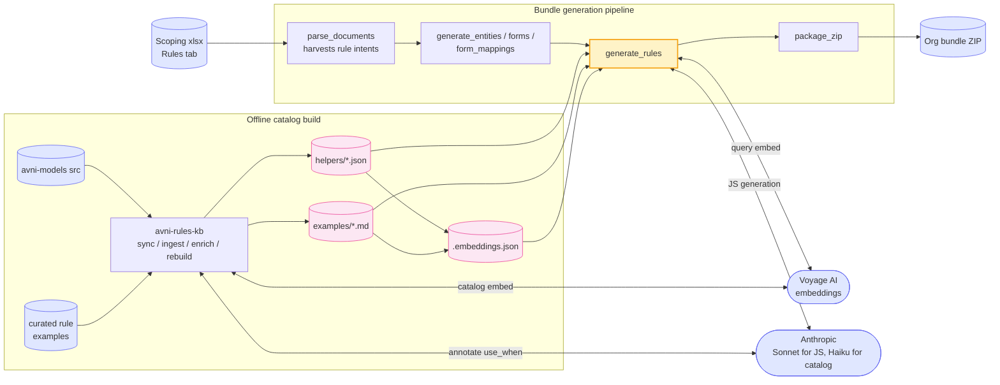
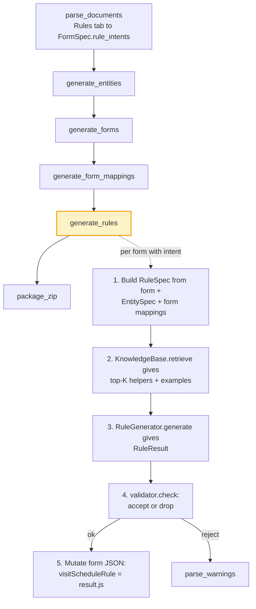

# Visit Schedule Rule Generation — Software Design Document

## 1. Objective

Today every rule field in a generated bundle (`visitScheduleRule`, `validationRule`, `encounterEligibilityCheckRule`, `enrolmentEligibilityCheckRule`, `subjectSummaryRule`, …) is emitted as an empty string (see `src/domain/generators.py:49,95,128,183,296-297`). That works for the prototype-then-customise loop, but means every implementation team rewrites the same JS snippets by hand against Avni's rule API.

This SDD describes how to **generate `visitScheduleRule` JS** from one of two inputs:

1. A new `Scheduling Rule` column in the modelling document (per encounter type / form).
2. A chat instruction in the existing agent ("schedule a delivery visit after 10 days when risk is high").

Output is a JS function string that conforms to Avni's [visit schedule rule contract](https://avni.readme.io/docs/writing-rules#4-visit-schedule-rule) and uses the [helper functions](https://avni.readme.io/docs/helper-functions) the rule API exposes. The function is dropped into the form JSON's `visitScheduleRule` field — no other generation pathway changes.

The design is deliberately **extensible to every rule type listed in the writing-rules page** — form element rules, validation rules, eligibility rules, summary rules, exit-eligibility rules. Visit schedule rule is the first concrete implementation; the data layout, prompt structure, and tool surface are shared.

The goal is **good-enough JS that compiles and runs against the Avni rule API**, not perfectly equivalent to a hand-written rule. When the LLM can't ground every reference (concept name, encounter type, helper method), the rule field stays empty and a `parse_warnings` entry records why — the team can fill it in later via chat.

---

## 2. Scope

### In scope

- A `Scheduling Rule` column convention for the modelling document (per encounter type row).
- A **rule knowledge base** indexed in a local vector store: helper-function signatures + docstrings, plus curated few-shot examples taken from the `List to automate (curated)` tab of `requirements/Self-service improvement.xlsx`.
- A `RuleSpec` Pydantic model that carries the natural-language intent + bundle-grounded context (form, subject type, program, encounter type, available concepts, visit types in scope).
- A `generate_rule(rule_spec, rule_kind)` function that retrieves relevant helpers/examples, prompts Claude, and returns a JS string + confidence + grounding notes.
- A new pipeline node `generate_rules` **after** `generate_form_mappings` that fills `visitScheduleRule` on each form JSON it can ground.
- A chat tool `set_visit_schedule_rule(form_name, intent)` that re-runs generation against the already-built bundle (uses the existing `bundle_editor` write path) and updates the form JSON's `visitScheduleRule` field.
- Validation: parse the returned JS through a syntax check, refuse to write anything that doesn't compile or doesn't follow the expected IIFE shape.

### Out of scope (this SDD)

- The other rule kinds (form element / validation / eligibility / summary). The architecture supports them, but only `visitScheduleRule` is wired through `generate_rules`. A second rule kind is one registry entry + a few examples — see §8.
- Skip-logic translation to Avni declarative rule format (that has its own deferred work item under `BUNDLE_GENERATOR_SDD.md` §9).
- Running the generated JS in a sandbox to verify behaviour. We syntax-check only.
- Editing the source `.xlsx`.
- Multi-org rule generation in one invocation — one bundle per run, same as today.

### Precondition

`EntitySpec` (the parser's output) is the ground truth for what concepts, encounter types, programs, and subject types exist in the bundle. The rule generator never references a symbol that isn't in `EntitySpec`. If the user's intent names something unknown ("schedule a Postnatal visit" when no `Postnatal` encounter type exists), the generator emits a warning and leaves the rule empty.

---

## 3. Motivation — why a knowledge base + few-shot, not pure prompting

`requirements/Self-service improvement.xlsx → List to automate (curated)` contains ~12 deduplicated visit-schedule rules drawn from implementation teams across `JSS`, `JSCS`, and other orgs — one canonical rule per distinct idiom, each paired with a natural-language `Prompt` column. The raw `List to automate` tab (~80 rules) is the source; `/curate-rules` (see `.claude/commands/curate-rules.md`) produces the curated tab by clustering on idiom and writing intents in the voice a user would type. The vocabulary is small:

- `imports.rulesConfig.VisitScheduleBuilder({individual | programEnrolment | programEncounter | encounter})`
- `imports.moment(...).add(N, 'days' | 'months').toDate()`
- `imports.lodash` for `_.find`, `_.chain`, `_.filter` over `individual.encounters` / `programEnrolment.getEncounters(true)`
- `getObservationReadableValue('<concept name>')` for reading form field values
- `encounter.earliestVisitDateTime || encounter.encounterDateTime` for finding "the visit date even on uploads"

A pure-prompt approach (just hand Claude the docs URL and intent) gets the shape right but hallucinates concept names, encounter type names, and helper method names that don't exist in this bundle. The fix is **two grounding sources at retrieval time**:

1. **Bundle context** — concepts, encounter types, programs, subject types are passed verbatim in the prompt. The model must pick from this list.
2. **Helper KB** — a static catalog of Avni rule API methods (name, signature, one-line description, "use when…" hint) lives in `resources/rules/helpers/`. Top-K relevant helpers are retrieved per intent and injected.
3. **Few-shot KB** — the rules in `List to automate (curated)` (one per distinct idiom, each with a paired natural-language `Prompt`) become a retrieval corpus. Top-K most-similar examples are pulled per intent and shown as in-context examples.

This is the "store helpers + examples; vectorise only at query time" path from `specs/rule_generation.md`. We pay the embedding cost only when generating, not on every bundle build.

---

## 4. Architecture

### 4.0 Overview

Bird's-eye view of the system. The bundle pipeline (centre) is largely
unchanged; rule generation is a new node that draws on a knowledge base
populated offline and calls two external services per form.



Three subsystems:

- **Offline catalog build** — operator-run CLI populates a stable, reviewable
  helper + example corpus on disk, plus an embedding cache. Runs rarely
  (when avni-models changes or new curated examples land).
- **Bundle generation pipeline** — existing LangGraph pipeline gains one
  node (`generate_rules`) that consumes the catalog at runtime.
- **External services** — Voyage AI (embeddings only) and Anthropic (Sonnet
  for rule JS, Haiku for offline catalog annotation).

Detailed per-node + per-stage diagrams live in
[`OVERALL_ARCHITECTURE.md`](OVERALL_ARCHITECTURE.md).

### 4.1 Reuse from existing code

- `EntitySpec` (`src/models.py:108`) — already carries every symbol the generated rule can legally reference.
- `generators.py` form-JSON writer — adds one line: `form_json["visitScheduleRule"] = rule_state.get(form_name, "")`.
- `bundle_editor.py` — exposes a write path that touches a single form JSON without rebuilding the bundle. The chat tool reuses it.
- The deterministic-baseline → LLM-enrichment pattern from `specs/INTELLIGENT_PARSING_SDD.md`: deterministic step parses intent + columns; LLM step generates JS; validation step decides accept / warn / drop.

### 4.2 New components

```
src/domain/rules/
  __init__.py
  knowledge_base.py        # helper + example catalog, embedding + retrieval
  rule_spec.py             # RuleSpec, RuleKind, RuleResult Pydantic models
  generator.py             # generate_rule(rule_spec, rule_kind) → RuleResult
  validator.py             # JS syntax check + IIFE-shape check + reference grounding
  prompts.py               # per-rule-kind prompt templates
  parser.py                # parse `Scheduling Rule` column from modelling sheet

resources/rules/
  helpers/
    entities/              # generated from avni-models/src by `python -m rules.kb sync`
      individual.json
      program_enrolment.json
      program_encounter.json
      abstract_encounter.json
      observation.json
      concept.json
    imports/               # hand-curated rules-config / imports.* namespaces
      visit_schedule.json  # VisitScheduleBuilder
      rule_condition.json
      moment.json
      lodash.json
  examples/
    visit_schedule/
      jss_phulwari.md      # one file per curated example (intent + JS + tags)
      jscs_baseline.md
      ...
```

A new pipeline node `generate_rules` is inserted **after** `generate_form_mappings`. The runner CLI gains a `--rules / --no-rules` flag (default `--rules` once the KB is populated).

### 4.3 End-to-end flow



**Why after `generate_form_mappings`:** so the pipeline and the chat tool both build `RuleSpec` from the same source (a bundle with mappings in place). Mappings don't read the rule fields, so the order is safe.

---

## 5. Data Model

### 5.1 `RuleKind`

```python
class RuleKind(str, Enum):
    VISIT_SCHEDULE = "visitScheduleRule"
    # Other rule kinds (validation, eligibility, summary, form-element) are added
    # to this enum only when wired up. See §8 for the extension pattern.
```

Each kind maps to:
- the JSON field it writes to (`visitScheduleRule` → form JSON's top-level field),
- the JS entity-param it expects (`individual` / `programEnrolment` / `programEncounter` / `encounter`),
- the return type the rule must produce (for visit schedule: an array of `VisitSchedule`).

### 5.2 `RuleSpec`

```python
class RuleSpec(BaseModel):
    rule_kind: RuleKind
    intent: str                          # natural-language ask
    # Bundle context — every name here is grounded in EntitySpec.
    form_name: str
    form_type: str                       # FormSpec.formType
    subject_type: str | None
    program: str | None
    encounter_type: str | None
    available_concepts: list[str]        # field names on this form (+ siblings if useful)
    available_encounter_types: list[str] # for "schedule a Delivery visit"
    available_programs: list[str]
```

### 5.3 `RuleResult`

```python
class RuleResult(BaseModel):
    rule_kind: RuleKind
    js: str                              # empty if validation rejected
    confidence: Literal["high", "medium", "low"]
    used_helpers: list[str]              # e.g. ["VisitScheduleBuilder.add", "moment.add"]
    referenced_concepts: list[str]       # concept names the JS reads from
    referenced_encounter_types: list[str]
    warnings: list[str]                  # ungrounded symbols, syntax failures, etc.
```

A form's `visitScheduleRule` is written only when `js != ""` and `validator.check` passes; otherwise the field stays empty and `warnings` flow into `BundleState.parse_warnings`.

### 5.4 `FormSpec` addition

Extend `src/models.py`:

```python
class FormSpec(BaseModel):
    ...
    rule_intents: dict[str, str] = Field(default_factory=dict)
    # keys are RuleKind values; populated by parser if the modelling doc has the column,
    # or by the chat tool when the user issues a rule instruction.
```

This is the only schema change to existing models — the rule generation pipeline owns everything else under `src/domain/rules/`.

---

## 6. Knowledge Base

### 6.1 Helper catalog (`resources/rules/helpers/`)

JSON files, one per source surface. Each entry:

```json
{
  "name": "Individual.findLatestObservationFromPreviousEncounters",
  "signature": "individual.findLatestObservationFromPreviousEncounters(conceptName, currentEncounter)",
  "applies_to": ["visitScheduleRule", "validationRule", "encounterEligibilityCheckRule", "subjectSummaryRule"],
  "use_when": "Reading the most recent value of a concept observed before the current encounter — trend / look-back rules.",
  "example_snippet": "const lastBP = individual.findLatestObservationFromPreviousEncounters('Systolic BP', encounter);"
}
```

**Catalog source.** The catalog is generated from **avni-models source directly** (`avni-models/src/`), not from the Avni helper-functions docs page. The docs page is incomplete — it documents ~38 methods while avni-models exposes ~60+ public methods on the entity classes a rule receives via `params.entity`. The docs page is used only as a **secondary source for `use_when` prose** when a method happens to appear there.

**Two sub-catalogs:**

1. **Per-entity helpers** (`resources/rules/helpers/entities/`) — instance methods on the avni-models classes a rule receives via `params.entity`. One file per class: `individual.json`, `program_enrolment.json`, `program_encounter.json`, `abstract_encounter.json`, `observation.json`, `concept.json`. The catalog files themselves are the source of truth for the method surface.

2. **Rule API namespaces** (`resources/rules/helpers/imports/`) — surfaces accessed via `imports.*`, which live in `rules-config` / `avni-client`, not in avni-models. One file per namespace: `visit_schedule.json` (`VisitScheduleBuilder`), `rule_condition.json` (`RuleCondition.when.*` chain), `moment.json`, `lodash.json`.

**Catalog regeneration.** A `python -m rules.kb sync` command walks avni-models source (path configurable; default `../avni-models/src`), lists public methods on the seven entity classes above, and joins each with JSDoc plus, where applicable, helper-functions docs prose. Output: regenerated entity JSON files committed as a static, reviewable snapshot — there is no runtime dependency on the avni-models repo. The `imports/` sub-catalog is hand-curated, since `rules-config` exposes a small, stable namespace.

**Scope of the MVP.** Only the helpers actually needed for visit-schedule generation are filled out with full `signature` + `use_when` + `example_snippet` — roughly: `getRealEventDate`, `findLatestObservationFromPreviousEncounters`, `getObservationReadableValue`, `findCancelEncounterObservationReadableValue`, `hasEncounterOfType`, `programEnrolment.getEncounters`, plus the `VisitScheduleBuilder` / `moment` / `lodash` namespaces. Remaining methods are seeded with `name` + one-line `use_when` only, so eligibility / validation / summary rules can be wired in incrementally without re-discovering the surface.

### 6.2 Example catalog (`resources/rules/examples/visit_schedule/`)

Each example is a Markdown file with structured frontmatter:

```markdown
---
rule_kind: visitScheduleRule
intent: "schedule daily attendance every weekday from the registration date"
entity_param: encounter
encounter_types: ["Daily Attendance"]
concepts: []
source_org: JSS
---
```js
"use strict";
({ params, imports }) => {
  const encounter = params.entity;
  const scheduleBuilder = new imports.rulesConfig.VisitScheduleBuilder({ encounter });
  ...
};
```
```

Population: examples are drawn from the `List to automate (curated)` tab of `requirements/Self-service improvement.xlsx`, produced by `/curate-rules` (see `.claude/commands/curate-rules.md`). That command deduplicates the raw `List to automate` tab into one canonical rule per distinct idiom and writes a natural-language `Prompt` column for each. Each row of the curated tab becomes one Markdown file with the frontmatter shape above — `ORG name` → `source_org`, `Form name` → the file slug, `Prompt` → `intent`, `Rule` → the fenced JS block. The `entity_param` and `encounter_types` fields are derived from the rule's JS body at generation time.

### 6.3 Retrieval

`knowledge_base.retrieve(rule_kind, intent, context)` runs at generation time:

1. Embed `intent` + a short context string (`form_type`, `subject_type`, `program`, `encounter_type`) with the `text-embedding-3-small` API.
2. Cosine-similarity against pre-embedded helper entries and examples scoped to `rule_kind`.
3. Return top-5 helpers + top-3 examples.

**Two distinct embedding steps, run at different times:**

- **Catalog embedding** — done **once, offline** by `python -m rules.kb rebuild`. Reads every file under `resources/rules/helpers/` and `resources/rules/examples/`, embeds each entry, writes vectors to `resources/rules/.embeddings.json`. Re-run only when the catalog files change.
- **Query embedding** — done **at generation time, only when there's an intent to generate against**. Embeds the ~50-token intent string and similarity-searches the cached catalog vectors.

Net effect: a bundle build with zero `Scheduling Rule` cells and no chat rule requests makes **zero embedding API calls**. The cost is gated by actual rule work, not by every `generate_bundles.py` invocation.

This matches the `rule_generation.md` plan: store source verbatim, no chunking (each helper/example is short enough to stand alone), and pay the embedding cost lazily.

**Storage.** Plain JSON (`resources/rules/.embeddings.json`) is sufficient at this catalog size (~125 vectors → ~1 MB; brute-force cosine in numpy is sub-millisecond). Revisit a dedicated vector store (sqlite-vec / Chroma / FAISS) only if the catalog grows past ~10K entries or needs concurrent writers.

---

## 7. Generation

### 7.1 Prompt structure (`prompts.py`)

```
SYSTEM: You generate Avni rule functions. Output ONLY a JS IIFE matching:
"use strict";
({ params, imports }) => { ... return ...; };

The function must:
- read params.entity as a <ENTITY_PARAM> (chosen per rule kind)
- use ONLY the helper APIs listed under HELPERS
- reference ONLY the concept names listed under AVAILABLE_CONCEPTS
- reference ONLY the encounter type names listed under AVAILABLE_ENCOUNTER_TYPES
- return <RETURN_TYPE>

USER:
INTENT: <intent>
RULE_KIND: <rule_kind>
FORM: <form_name> (formType=<form_type>, subject=<subject_type>, program=<program>)
AVAILABLE_CONCEPTS: <list>
AVAILABLE_ENCOUNTER_TYPES: <list>
AVAILABLE_PROGRAMS: <list>
HELPERS:
  <top-K helper entries>
EXAMPLES:
  <top-K examples>

Output a JSON object: { "js": "...", "confidence": "...", "used_helpers": [...], "referenced_concepts": [...], "referenced_encounter_types": [...], "notes": "..." }.
```

We use the Claude API's structured-output mode (tool-call shape) so the response is a well-formed `RuleResult` shape and we don't have to parse free-form JS out of prose.

### 7.2 Confidence

The model self-reports `confidence` (high / medium / low) on `RuleResult`. This is **telemetry only** — it does not gate writes. The gate is `validator.check` (§7.3): a rule that parses cleanly and grounds every symbol is written, regardless of confidence.

We log confidence so eval can spot patterns later (e.g. "every low-confidence rule that passed validation needed manual revision" → tighten the validator; "high-confidence rules sometimes regress" → review the prompt). Until that signal exists, behaviour stays binary: validation passes → write, fails → drop.

### 7.3 Validation (`validator.py`)

```python
def check(result: RuleResult, spec: RuleSpec) -> tuple[bool, list[str]]:
```

1. Parse `result.js` with `esprima` (Python port `esprima-python`). Reject on syntax error.
2. Verify the top-level shape is an arrow function expression taking `{ params, imports }`.
3. Walk the AST for `Literal` nodes used as the `name` arg of `getObservationReadableValue` and similar accessors; every such string must be in `spec.available_concepts`. Off-list → reject with warning listing the off-list names.
4. Walk for `encounterType:` property values; every literal must be in `spec.available_encounter_types`. Off-list → reject.

The validator does **not** execute the JS. Runtime-equivalence is out of scope (§2).

---

## 8. Extensibility — other rule kinds

To add a second rule kind (e.g. `encounterEligibilityCheckRule`):

1. Add it to the `RuleKind` enum with its target JSON field, entity param, and return type.
2. Drop a helper-catalog file under `resources/rules/helpers/` if the surface isn't already covered, and a few curated examples under `resources/rules/examples/<rule_kind>/`.
3. Add a prompt template entry in `prompts.py` for the new return-type rubric (e.g. boolean for eligibility, string for summary).
4. Pick the field in the generator JSON to write to (e.g. `encounter_type_json["encounterEligibilityCheckRule"]`).

No new pipeline node, no schema change beyond enum extension. The same `generate_rule(rule_spec, rule_kind)` call site handles every kind.

This is the extensibility ask in `requirements/rules.md` ("approach should be extensible for other rules") — the rule kind is data, not code.

---

## 9. Inputs

### 9.1 Scoping-document intake — the `Rules` / `Form Rules` tab

Rule intents live on a dedicated **Rules** (or **Form Rules**) tab in the scoping workbook. Detected by `_classify_sheet` when the sheet has a form-name column (`Form name`, `Form`, or `Name`, case-insensitive) and at least one rule-column alias. Each row carries intents for **one form**; cancellation forms and program-exit forms get their own rows distinct from the parent encounter type's row.

Shape:

| Form name | Visit Schedule Rule | Encounter Eligibility Rule | Validation Rule | … |
|---|---|---|---|---|
| `ANC Followup` | "schedule next visit 30 days later" | "" | "" | … |
| `ANC Followup Cancellation` | "reschedule unless cancel reason is exit" | "" | "" | … |
| `Pregnancy Exit` | "return empty" | "" | "BP must be present" | … |

The parser recognises these rule-field aliases:

| Form-JSON field | Column-header aliases |
|---|---|
| `visitScheduleRule` | `visit schedule rule`, `scheduling rule`, `vs rule` |
| `validationRule` | `validation rule`, `form validation rule` |
| `encounterEligibilityCheckRule` | `encounter eligibility rule`, `encounter eligibility check rule`, `eligibility rule` |
| `enrolmentEligibilityCheckRule` | `enrolment eligibility rule`, `enrolment eligibility check rule` |
| `subjectSummaryRule` | `subject summary rule` |
| `enrolmentSummaryRule` | `enrolment summary rule` |
| `decisionRule` | `decision rule` |

Only the fields whose `RuleKind` value is in `domain.rules.rule_spec.RuleKind` are generated (currently just `visitScheduleRule`). Other parsed intents ride along on `FormSpec.rule_intents` until a generator for that kind is wired (see §8). The `generate_rules` node logs a warning and skips unknown kinds rather than failing.

Cell content is treated as natural-language intent — no required syntax. Examples:

- "After 10 days from registration, schedule a follow-up if risk == High"
- "Every weekday between registration and program exit"
- "First of each month for 6 months after enrolment"

A blank cell means "no rule"; a row with all rule cells blank is ignored. Forms without a matching row keep `rule_intents = {}` (no rule generated, same as today).

### 9.2 Chat tool

`set_visit_schedule_rule(form_name: str, intent: str)` is exposed to the chat agent (`src/chat/tools.py`). It:

1. Loads the current bundle via the existing bundle editor.
2. Looks up the form JSON, builds a `RuleSpec` from current bundle context, calls `generate_rule`.
3. On success, writes the JS into the form's `visitScheduleRule` and re-zips through the existing write path.
4. On failure (validation reject), reports the warnings back in chat and writes nothing.

Same shape will work for the other rule kinds when they come online — `set_<rule_kind>(...)` per kind, all routed through `generate_rule`.

---

## 10. Failure modes & logging

| Case | Behaviour |
|---|---|
| `Scheduling Rule` column missing | Skip — `rule_intents` is empty, `visitScheduleRule` stays `""`. |
| Cell present but blank | Same as above — explicit no-op. |
| LLM returns syntactically invalid JS | Validator drops, `parse_warnings` gets `"<form>: visit schedule rule failed JS parse"`. |
| LLM references off-bundle concept | Validator drops, warning lists the off-list names. |
| Chat tool called for a form not in the bundle | Tool returns an error string into the chat transcript; no file write. |
| KB embedding cache missing | First run re-embeds and writes the cache. |
| Anthropic API call fails | Rule stays empty, warning logged, pipeline continues — same posture as `INTELLIGENT_PARSING_SDD.md` for enrichment failures. |

Every warning is namespaced `rules.<rule_kind>.<form>: <reason>` and flows into the existing `BundleState.parse_warnings`, so the runner script's summary already surfaces them.

---

## 11. Files to create / change

| File | Status | Description |
|---|---|---|
| `src/models.py` | edit | Add `FormSpec.rule_intents: dict[str, str]`. |
| `src/domain/rules/__init__.py` | new | Package marker. |
| `src/domain/rules/rule_spec.py` | new | `RuleKind`, `RuleSpec`, `RuleResult`. |
| `src/domain/rules/knowledge_base.py` | new | Catalog load, embedding cache, retrieval. |
| `src/domain/rules/prompts.py` | new | Per-rule-kind prompt templates. |
| `src/domain/rules/generator.py` | new | `generate_rule(spec, kind) → RuleResult`. |
| `src/domain/rules/validator.py` | new | JS parse + grounding check. |
| `src/domain/rules/parser.py` | new | `Scheduling Rule` column extraction. |
| `src/pipeline/nodes.py` | edit | Add `generate_rules` node after `generate_form_mappings`. |
| `src/pipeline/graph.py` | edit | Wire the new node. |
| `src/pipeline/state.py` | edit | Add `rule_warnings: list[str]` (or fold into existing `parse_warnings`). |
| `src/domain/generators.py` | edit | Write `visitScheduleRule` from rule state instead of hard-coded `""`. |
| `src/chat/tools.py` | edit | Add `set_visit_schedule_rule(form_name, intent)`. |
| `resources/rules/helpers/entities/*.json` | generated | Per-entity helper catalog (one file per avni-models class: `individual`, `program_enrolment`, `program_encounter`, `abstract_encounter`, `observation`, `concept`). Produced by `python -m rules.kb sync` against an avni-models checkout. |
| `resources/rules/helpers/imports/*.json` | new | Hand-curated `imports.*` namespace catalogs (`visit_schedule`, `rule_condition`, `moment`, `lodash`). |
| `src/domain/rules/kb_sync.py` | new | CLI entry for `python -m rules.kb sync` — extracts public method surface from avni-models source. |
| `resources/rules/examples/visit_schedule/*.md` | generated | Built from `requirements/Self-service improvement.xlsx → List to automate (curated)`. Re-run `/curate-rules` to refresh the source tab; a small ingestion step writes one Markdown per curated row. |
| `resources/rules/.embeddings.json` | generated | Embedding cache (gitignored). |

New runtime dependency: `esprima` (JS parser for Python — pure-python, no Node toolchain).

No change to `generate_bundles.py` CLI required, but a `--no-rules` flag is added so the existing prototype-fast loop is preserved.

